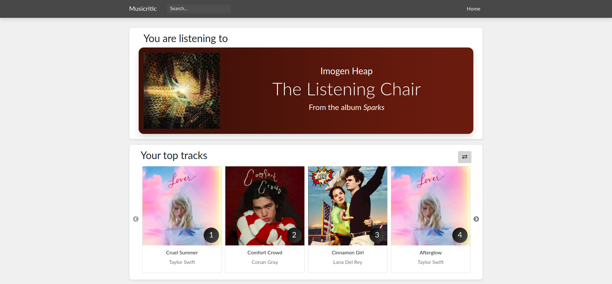
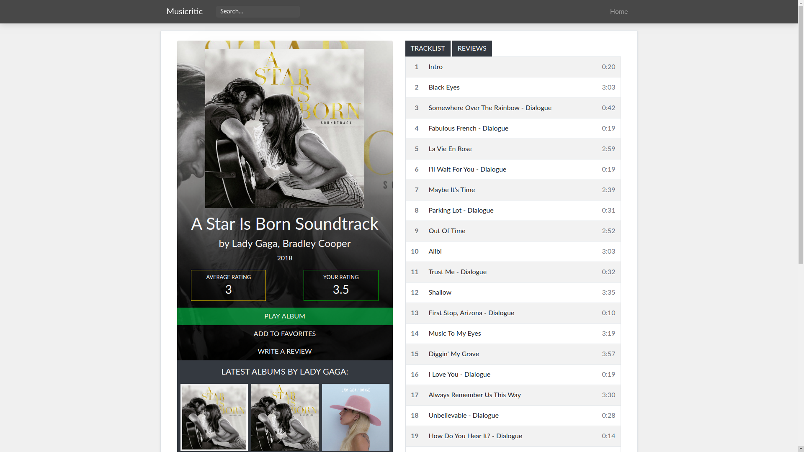
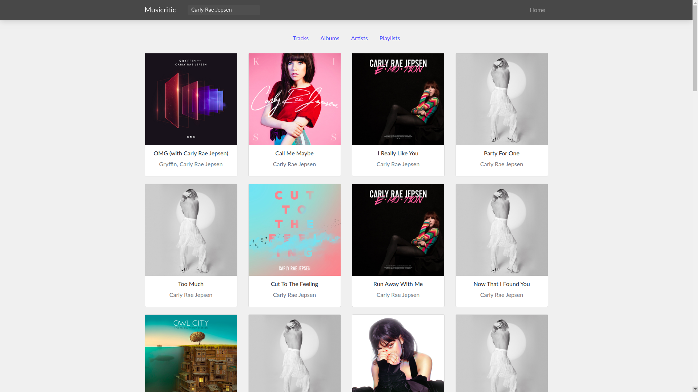

# Musicritic

Musicritic wants to become your personal music-specific Metacritic. You'll be able to rate the music you listen to, read other people's opinions and help create a healthy community of music lovers!

## Table of Contents

-   [Features](#features)
-   [Community](#community)
    -   [Installation and Usage](#installation-and-usage)
    -   [Suggest a new feature or report a bug](#suggest-a-new-feature-or-report-a-bug)
    -   [Do it yourself](#do-it-yourself)
    -   [Maintainers](#maintainers)
    -   [Hall of Fame](#hall-of-fame)

## Features

Musicritic has still got a long way to go, but here are some things you can already do!

-   Connect yourself to Spotify (required to make use of the rest of the features!);
-   Check your recently listened to tracks and recent top tracks;
-   Look up albums, tracks, artists, and playlists;
-   See more information on tracks and albums in specific pages.

### Home page (when logged in)


### Track page


### Album page


### Search results page


## Community

So you want to help us? How kind of you! Just know you can contribute in many ways.
Please, note that we have a [Code of Conduct](.github/CODE_OF_CONDUCT.md), which we expect to be strictly respected.

### Installation and Usage

Before getting to run **Musicritic** itself, you'll need to set up some environment variables. For this purpose, you'll need to create two integrations: one with [Spotify](https://developer.spotify.com/dashboard/) and the other one with [Firebase](https://console.firebase.google.com/). Both are very simple to configure, so don't let these additional steps scare you out!

#### Configure Spotify and Firebase

Create a new file named `.env` with the same fields as the `.env.example` file. You're going to fill this file with information to link Spotify and Firebase with **Musicritic**.

##### Spotify

Access [Spotify Developer](https://developer.spotify.com/dashboard/) with your *Spotify Account* and follow these steps:

1. Create a new `Client ID` in *DashBoard*
2. Fill the information that Spotify asks
3. After created, put the `Client ID` and `Client Secret ID` in the `.env`
4. Go to **Edit Settings** at your Spotify Client ID
5. Set the **Redirect URLs** to `http://localhost:5000/auth/callback`

##### Firebase

Access [Firebase](https://console.firebase.google.com/) with your Google Account and follow these steps:

1. Add a new project
2. Go to *Project Overview*
3. Click in the symbol `</>`
4. Copy your `apiKey`, `authDomain`, `databaseURL` and put it in the the `.env`
5. Go to *Project Configuration > Service Accounts*
6. Click in *Create a new Private Key* and save the file in a safe place, please don't commit this file
7. Place the *full path* to your file at the `FIREBASE_SERVICE_ACCOUNT` fild in `.env`

With both configured, you're ready to run **Musicritic**!

#### Starting Musicritic

With *Firebase* and *Spotify* configured, now you'll need to install the dependencies. We suggest using [*yarn*](https://yarnpkg.com/en/):

```sh
yarn install
```

With everything set, to run both **client** and **server**, use:

```sh
yarn dev
```

Access your http://localhost:3000 and Voila! If you got stuck in the middle of the process, make sure to contact us at calluswhatuwant@gmail.com so that we can help you out!

> If you'd rather run each one separately, `yarn client` and `yarn server`, respectively, are your go-to commands.

This is it! Now, if you make any modifications, the application should update itself automatically.

### Suggest a new feature or report a bug

Check our [issue templates](.github/ISSUE_TEMPLATE).

### Do it yourself

We're working on a CONTRIBUTING file. Meanwhile, we've got some open issues!

### Maintainers

[@JoseRenan](http://github.com/JoseRenan) and [@JRobsonJr](http://github.com/JRobsonJr)

### Hall of Fame

[](https://sourcerer.io/fame/JRobsonJr/calluswhatyouwant/musicritic/links/0)[](https://sourcerer.io/fame/JRobsonJr/calluswhatyouwant/musicritic/links/1)[](https://sourcerer.io/fame/JRobsonJr/calluswhatyouwant/musicritic/links/2)[](https://sourcerer.io/fame/JRobsonJr/calluswhatyouwant/musicritic/links/3)[](https://sourcerer.io/fame/JRobsonJr/calluswhatyouwant/musicritic/links/4)[](https://sourcerer.io/fame/JRobsonJr/calluswhatyouwant/musicritic/links/5)[](https://sourcerer.io/fame/JRobsonJr/calluswhatyouwant/musicritic/links/6)[](https://sourcerer.io/fame/JRobsonJr/calluswhatyouwant/musicritic/links/7)
